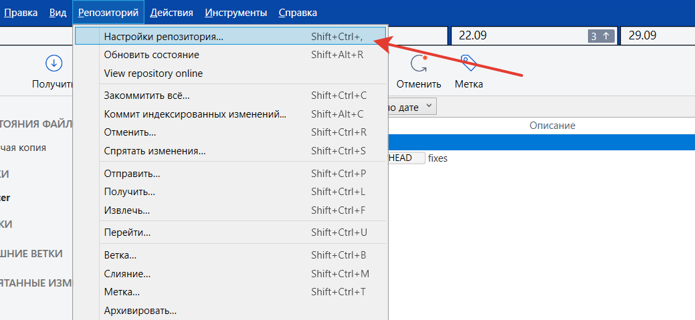

# 29.09

Установите gulp глобально:

```
npm install -g gulp
```

Склонируйте себе репозиторий:

```
https://github.com/irs-webdev/gulp-test
```

Теперь в папке с репозиторием будут доступны команды:

- `gulp` - запускает сборку проекта и отслеживает изменения в файлах
- `gulp build` - просто собирает проект
- `gulp scripts` - собирает только скрипты
- `gulp styles` - собирает только scss
- `gulp clean` - очищает папку dist

Чтобы заливать последующие изменения в свой репозиторий, измените ссылку на удаленный репозиторий в настройках:




## Домашнее задание

### Подключение библиотек

Сверстайте небольшую текстовую страницу с несколькими картинками (например из домашки обычного курса).

Установите модуль [medium-zoom](https://www.npmjs.com/package/medium-zoom):

```
npm install medium-zoom
```

С его помощью сделайте так, чтобы изображения на странице увеличивались по клику.

Установите модуль [vanilla-picker](https://www.npmjs.com/package/vanilla-picker):

```
npm install vanilla-picker
```

Добавьте на страницу кнопку, которая будет вызывать окошко с выбором цвета. Примените выбранный цвет в качестве фона для всей страницы.

**Внимание:** в примерах подключения библиотек используется новая версия синтаксиса JS, где модули подключаются через команду `import`. Браузеры пока не поддерживают этот стандарт, но выражение с `import` можно легко переписать с использованием `require()`:

```js
// новый стандарт
import mediumZoom from 'medium-zoom';

// то же самое, но со старым стандартом
var mediumZoom = require('medium-zoom');
```

### Минификация JS

Для уменьшения размера файлов после сборки (js, css) их часто подвергают минификации.

Основной способ уменьшить размер javasript или css-файла - это удалить все лишние пробелы и переносы строк. Но размер js можно уменьшить более хитрыми способами - заменой имен переменных на более короткие, использованием более короткой записи операций (например `i++` вместо `i = i + 1`) и разными хаками (`i = Math.floor(i * 0.9)` можно заменить на `i=i * 0.9 | 0`). Для этого есть специальные [инструменты](https://learn.javascript.ru/minification). Их можно использовать в виде отдельных команд, как `sass` и `browserify`, а можно в составе системы сборки.

Установите [gulp-uglify](https://www.npmjs.com/package/gulp-uglify):

```
npm install gulp-uglify
```

К сожалению в мире современной веб-разработки мало что работает сразу, поэтому нам понадобится еще один модуль:

```
npm install vinyl-buffer
```

Теперь мы можем использовать эти модули в `gulpfile.js`:

```js
var uglify = require('gulp-uglify');
var buffer = require('vinyl-buffer');
```

И можем добавить шаг с минификацией в задачу сборки js:

```js
gulp.task('scripts', function() {
    return browserify('./app/js/main.js')
        .bundle()
        .pipe(source('main.js'))

        // вот эти две строки
        .pipe(buffer())
        .pipe(uglify())

        .pipe(gulp.dest('./dist/js'));
});
```

Проверьте что при сборке не возникает ошибок, и посмотрите на получившийся на выходе js-файл.

### Полезные ссылки

- [Зачем вообще нужен Gulp](https://akuma.su/blog/gulp-chast-1-zachem-on-nuzhen.html)
- [Gulp + Browserify](https://frontender.info/gulp-browserify-starter-faq/)
- [Зачем вообще так усложнять обычную верстку](https://habr.com/company/mailru/blog/340922/) (там немного другие инструменты, но суть одна)